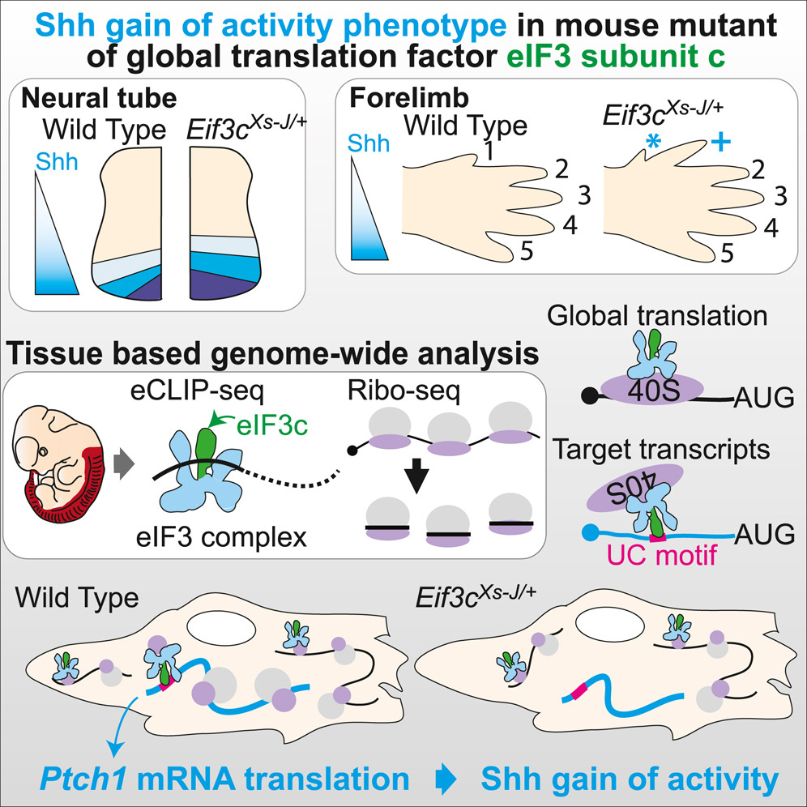

This repository provides the data processing pipeline and analysis codes used in:

Fujii K, Zhulyn O, Byeon GW, Kerr C, Genuth N, Walsh E, Barna M. Controlling tissue patterning by translational regulation of signaling transcripts through the core translation factor eIF3c.

### Description
* Raw sequencing data files are available in GEO: GSE183472
* alignment directory contains pipeline scripts needed to generate count tables for eCLIP and Ribo-seq experiments in the paper.
* analysis directory contains R script that reproduces analysis and plots in the paper.
